# Mosquito Data Management System

**Manual de usuario del sistema**  
**Fecha:** 05 de mayo de 2026

## Tabla de contenido

- [1. Introducción](#1-introducción)
  - [1.1. Propósito del manual](#11-propósito-del-manual)
  - [1.2. Alcance](#12-alcance)
- [2. Descripción general](#2-descripción-general)
  - [2.1. Tecnologías empleadas en el desarrollo del sistema](#21-tecnologías-empleadas-en-el-desarrollo-del-sistema)
  - [2.2. Flujo de trabajo](#22-flujo-de-trabajo)
  - [2.3. Indicadores calculados](#23-indicadores-calculados)
- [3. Requisitos](#3-requisitos)
  - [3.1. Sistema operativo](#31-sistema-operativo)
  - [3.2. Hardware mínimo](#32-hardware-mínimo)
- [4. Roles y permisos](#4-roles-y-permisos)
- [5. Interfaz de usuario](#5-interfaz-de-usuario)
  - [5.1. Barra superior](#51-barra-superior)
  - [5.2. Barra de resumen](#52-barra-de-resumen)
  - [5.3. Panel de pestañas](#53-panel-de-pestañas)
  - [5.4. Barra de filtros](#54-barra-de-filtros)
  - [5.5. Área de trabajo](#55-área-de-trabajo)
- [6. Guía de funcionalidad](#6-guía-de-funcionalidad)
  - [6.1. Inicio de sesión](#61-inicio-de-sesión)
    - [6.1.1. Elementos de la pantalla de inicio de sesión](#611-elementos-de-la-pantalla-de-inicio-de-sesión)
    - [6.1.2. Procedimiento de la pantalla de inicio de sesión](#612-procedimiento-de-la-pantalla-de-inicio-de-sesión)
    - [6.1.3. Validaciones del sistema de la pantalla de inicio de sesión](#613-validaciones-del-sistema-de-la-pantalla-de-inicio-de-sesión)
    - [6.1.4. Política mínima de contraseñas](#614-política-mínima-de-contraseñas)
    - [6.1.5. Almacenamiento seguro de usuarios](#615-almacenamiento-seguro-de-usuarios)
  - [6.2. Gestión de usuarios](#62-gestión-de-usuarios)
    - [6.2.1. Elementos de la pantalla de gestión de usuarios](#621-elementos-de-la-pantalla-de-gestión-de-usuarios)
    - [6.2.2. Procedimiento de la pantalla de gestión de usuarios](#622-procedimiento-de-la-pantalla-de-gestión-de-usuarios)
    - [6.2.3. Validaciones del sistema de la pantalla de gestión de usuarios](#623-validaciones-del-sistema-de-la-pantalla-de-gestión-de-usuarios)
  - [6.3. Historial de datos guardados](#63-historial-de-datos-guardados)
    - [6.3.1. Elementos de la pantalla de historial](#631-elementos-de-la-pantalla-de-historial)
    - [6.3.2. Procedimiento de la pantalla de historial](#632-procedimiento-de-la-pantalla-de-historial)
    - [6.3.3. Validaciones del sistema de la pantalla de historial](#633-validaciones-del-sistema-de-la-pantalla-de-historial)
  - [6.4. Guardar datos](#64-guardar-datos)
    - [6.4.1. Elementos de la pantalla de guardado](#641-elementos-de-la-pantalla-de-guardado)
    - [6.4.2. Procedimiento de la pantalla de guardado](#642-procedimiento-de-la-pantalla-de-guardado)
    - [6.4.3. Validaciones del sistema de la pantalla de guardado](#643-validaciones-del-sistema-de-la-pantalla-de-guardado)
    - [6.4.4. Almacenamiento de datasets e historial](#644-almacenamiento-de-datasets-e-historial)
  - [6.5. Cargar archivo Excel](#65-cargar-archivo-excel)
    - [6.5.1. Datos de entrada del archivo Excel](#651-datos-de-entrada-del-archivo-excel)
    - [6.5.2. Elementos de la pantalla de carga de Excel](#652-elementos-de-la-pantalla-de-carga-de-excel)
    - [6.5.3. Procedimiento de la pantalla de carga de Excel](#653-procedimiento-de-la-pantalla-de-carga-de-excel)
    - [6.5.4. Validaciones del sistema de la pantalla de carga de Excel](#654-validaciones-del-sistema-de-la-pantalla-de-carga-de-excel)
  - [6.6. Pestaña Datos](#66-pestaña-datos)
    - [6.6.1. Elementos de la pestaña Datos](#661-elementos-de-la-pestaña-datos)
    - [6.6.2. Procedimiento de la pestaña Datos](#662-procedimiento-de-la-pestaña-datos)
    - [6.6.3. Validaciones del sistema de la pestaña Datos](#663-validaciones-del-sistema-de-la-pestaña-datos)
  - [6.7. Pestaña Gráficos](#67-pestaña-gráficos)
    - [6.7.1. Elementos de la pestaña Gráficos](#671-elementos-de-la-pestaña-gráficos)
    - [6.7.2. Procedimiento de la pestaña Gráficos](#672-procedimiento-de-la-pestaña-gráficos)
    - [6.7.3. Validaciones del sistema de la pestaña Gráficos](#673-validaciones-del-sistema-de-la-pestaña-gráficos)
  - [6.8. Pestaña Mapa](#68-pestaña-mapa)
    - [6.8.1. Elementos de la pestaña Mapa](#681-elementos-de-la-pestaña-mapa)
    - [6.8.2. Procedimiento de la pestaña Mapa](#682-procedimiento-de-la-pestaña-mapa)
    - [6.8.3. Validaciones del sistema de la pestaña Mapa](#683-validaciones-del-sistema-de-la-pestaña-mapa)
- [7. Casos especiales durante la carga, análisis y visualización de datos](#7-casos-especiales-durante-la-carga-análisis-y-visualización-de-datos)
  - [7.1. Ausencia de ovitrampas positivas](#71-ausencia-de-ovitrampas-positivas)
  - [7.2. Denominador igual a cero](#72-denominador-igual-a-cero)
  - [7.3. Ausencia de semanas epidemiológicas válidas](#73-ausencia-de-semanas-epidemiológicas-válidas)
  - [7.4. Ausencia de coordenadas válidas](#74-ausencia-de-coordenadas-válidas)
  - [7.5. Duplicados reales en los datos](#75-duplicados-reales-en-los-datos)

# 1. Introducción
## 1.1. Propósito del manual
Este manual tiene como propósito guiar al usuario en el uso de la aplicación de escritorio **“Mosquito Data Management System”**, diseñada para la parroquia Pacto, ya que las capas cartográficas incorporadas en el módulo de mapa pertenecen exclusivamente a esta zona, su objetivo es facilitar la carga de información desde archivos Excel, el análisis mediante gráficos y mapas, y la exportación de resultados para apoyo técnico y operativo.

## 1.2. Alcance
El manual cubre las funciones de la aplicación, entre las cuales se incluyen:

- Inicio de sesión, autenticación local por usuario y acceso al sistema

- Carga de archivos Excel, validación y confirmación de mapeo de columnas y limpieza automática de datos

- Guardado y recuperación de datasets locales

- Visualización y filtrado de datos en tabla

- Visualización de gráficos e indicadores

- Visualización espacial en mapas

- Exportación de gráficos y mapas

Este manual no cubre la captura de datos en campo, ni la administración avanzada del sistema operativo del equipo.

# 2. Descripción general
La aplicación **“Mosquito Data Management System”** es un sistema de escritorio orientado al manejo de información de ovitrampas para vigilancia entomológica. Permite transformar datos tabulares provenientes de archivos Excel en información analítica útil mediante tablas, gráficos y mapas interactivos.

## 2.1. Tecnologías empleadas en el desarrollo del sistema
El sistema fue desarrollado en Python 3.12 y emplea PySide6 para la construcción de la interfaz gráfica de escritorio, complementándose con diversas librerías especializadas para el procesamiento, análisis y visualización de la información, entre ellas pandas, openpyxl, xlrd, NumPy, SciPy, Plotly, Folium, QWebEngineView y pickle; adicionalmente, incorpora SQLite como motor de base de datos para el almacenamiento de metadatos y de la información estructural de la aplicación.

Se distribuye como un ejecutable autónomo generado mediante PyInstaller y optimizado con UPX, lo que permite su ejecución en el equipo de destino sin requerir la instalación previa del intérprete de Python ni de dependencias o librerías adicionales.

## 2.2. Flujo de trabajo
Este se estructura en cuatro etapas principales: el inicio de sesión, mediante credenciales definidas según el rol del usuario; la carga del archivo Excel con los datos de ovitrampas recolectados en campo; el acceso al panel principal, donde los datasets se visualizan a través de tablas, gráficos y un mapa interactivo; y, finalmente, la exportación de gráficos y mapas.

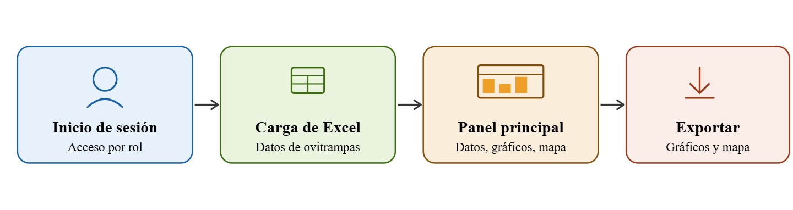
-----------
**Figura 1.** *Flujo de trabajo general del aplicativo, desde el acceso del usuario hasta la exportación de resultados.*

## 2.3. Indicadores calculados
**Índice de Ovitrampas Positivas (OPI):** mide el porcentaje de ovitrampas inspeccionadas que resultaron positivas durante una semana epidemiológica, considerándose positivas aquellas que presentan al menos un huevo. Este indicador permite estimar la presencia del vector en el área evaluada.

$$OPI(\%) = \left( \frac{Número\ de\ ovitrampas\ positivas}{Número\ total\ de\ ovitrampas\ revisadas} \right)x100$$

**Índice de Densidad de Huevos (EDI):** mide el número promedio de huevos recolectados por cada ovitrampa positiva durante una semana epidemiológica, considerándose positivas aquellas que presentan al menos un huevo. Este indicador refleja la intensidad de oviposición del vector en los sitios donde se registró actividad.

$$EDI = (\frac{Total\ de\ huevos\ recolectados}{Número\ de\ ovitrampas\ positivas})$$

# 3. Requisitos
## 3.1. Sistema operativo
| Requisito | Versión mínima                     | Recomendado               |
|-----------|------------------------------------|---------------------------|
| Windows   | Windows 10 (64-bits, versión 1903) | Windows 10 o 11 (64-bits) |

Nota: La aplicación no está disponible para macOS, ni Linux en esta versión.

## 3.2. Hardware mínimo
| Componente             | Mínimo                                      | Recomendado                 |
|------------------------|---------------------------------------------|-----------------------------|
| Procesador             | Intel Core i3 / AMD Ryzen 3 (2 GHz, 64-bit) | Intel Core i5 o superior    |
| RAM                    | 4 GB                                        | 8 GB o más                  |
| Espacio en disco       | 500 MB libres                               | 1 GB o más                  |
| Resolución de pantalla | 1 280 × 720 px                              | 1 920 × 1 080 px o superior |

Nota: La aplicación desactiva la aceleración GPU por hardware automáticamente para garantizar compatibilidad con equipos sin tarjeta gráfica dedicada. El rendimiento visual puede ser levemente inferior, pero la funcionalidad es completa.

# 4. Roles y permisos
| Rol           | Descripción                                  | Permisos                                                                                                           |
|---------------|----------------------------------------------|--------------------------------------------------------------------------------------------------------------------|
| Administrador | Usuario con control total del sistema        | Cargar datos, exportar resultados, configurar opciones y gestionar usuarios (creación, modificación y eliminación) |
| Analista      | Usuario orientado al análisis de información | Cargar datos y exportar resultados                                                                                 |
| Solo lectura  | Usuario con acceso limitado                  | Recuperar datasets cargados en el historial, visualizar gráficos y mapas                                           |

# 5. Interfaz de usuario
La ventana principal del aplicativo se compone de los siguientes elementos:

## 5.1. Barra superior
Contiene el nombre de la aplicación y los accesos principales del sistema. En esta zona se ubican:

- **Logo y nombre de la aplicación:** identifican el sistema

- **Nombre del archivo cargado:** muestra el archivo que se encuentra en uso

- **Botón Cargar Excel:** permite importar un archivo Excel al sistema

- **Botón Guardar:** permite almacenar datos localmente

- **Botón Historial:** permite consultar y recuperar datasets guardados localmente

- **Botón Usuarios:** permite gestionar usuarios (visible solo para administradores)

- **Información del usuario autenticado:** muestra el nombre y rol del usuario que ha iniciado sesión

- **Botón Salir:** permite cerrar la sesión o salir del sistema

-----------
**Figura 2.** *Barra superior de la ventana principal del aplicativo.*

## 5.2. Barra de resumen
Se muestra una vez cargados los datos y presenta indicadores rápidos del conjunto de información activo, permitiendo una lectura inmediata del estado de los datos cargados. Incluye:

- **Total de ovitrampas:** muestra la cantidad total de datos de ovitrampas cargados en el sistema

- **Ovitrampas únicas:** indica la cantidad de ovitrampas con código único registradas en el dataset

- **Ovitrampas positivas:** muestra la cantidad de datos de ovitrampas con resultado positivo

- **Positividad:** indica el porcentaje de datos positivos respecto al total de datos cargados en el dataset

- **Ovitrampas en mapa:** muestra la cantidad de datos de ovitrampas que cuentan con coordenadas válidas y que pueden visualizarse en el mapa

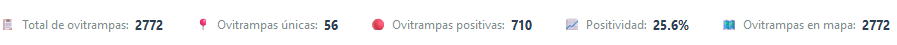
-----------
**Figura 3.** *Barra de resumen del aplicativo.*

## 5.3. Panel de pestañas
Constituye el mecanismo principal de navegación dentro del aplicativo y permite alternar entre las tres áreas de trabajo disponibles:

- **Datos:** permite visualizar y gestionar la información cargada en el sistema

- **Gráficos:** permite consultar la representación visual de los datos mediante gráficos

- **Mapa:** permite visualizar la distribución geográfica de los datos cargados

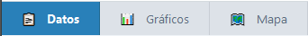
-----------
**Figura 4.** *Panel de pestañas del aplicativo.*

## 5.4. Barra de filtros
Cada pestaña incorpora en su parte superior una barra de controles que permite delimitar la información mostrada según los criterios de búsqueda seleccionados.

-----------
**Figura 5.** *Barra de filtros del aplicativo.*

## 5.5. Área de trabajo
Corresponde a la zona central de la ventana, en la que se muestra el contenido de la pestaña seleccionada. Su contenido varía según el módulo activo:

- **Datos:** se visualiza la tabla de datos cargados

- **Gráficos:** se presentan las visualizaciones estadísticas

- **Mapa:** se despliega el mapa interactivo con la distribución geoespacial de las ovitrampas

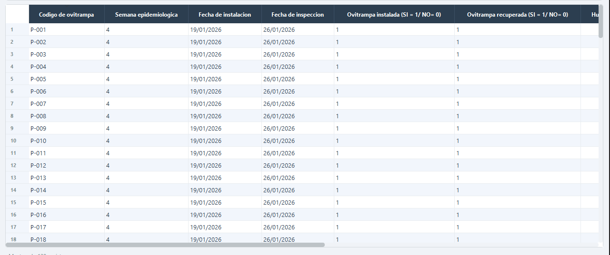
-----------
**Figura 6.** *Área de trabajo del aplicativo.*

# 6. Guía de funcionalidad
## 6.1. Inicio de sesión
Esta sección describe el procedimiento para acceder a la aplicación mediante la ventana de autenticación.

### 6.1.1. Elementos de la pantalla de inicio de sesión
La ventana de acceso contiene los siguientes componentes:

- Encabezado con el nombre de la aplicación

- Subtítulo: “Sistema de Monitoreo de Ovitrampas”

- Campo Usuario

- Campo Contraseña

- Botón Iniciar Sesión

- Área de mensajes de error

- Botón de cierre (X)

- Pie de página con la organización y la versión del sistema

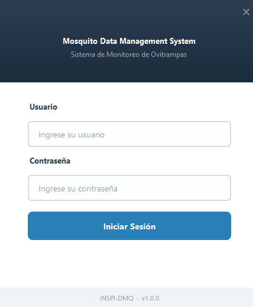
-----------
**Figura 7.** *Ventana de inicio de sesión.*

### 6.1.2. Procedimiento de la pantalla de inicio de sesión
- Abra la aplicación

- Espere a que se muestre la ventana de inicio de sesión

- En el campo Usuario, escriba su nombre de usuario

- En el campo Contraseña, escriba su contraseña

- Haga clic en Iniciar Sesión (también puede presionar la tecla Enter desde el campo de contraseña para intentar el acceso)

- Si las credenciales son correctas, la aplicación abrirá el panel principal

- Si las credenciales no son válidas, se mostrará un mensaje de error y deberá intentar nuevamente

### 6.1.3. Validaciones del sistema de la pantalla de inicio de sesión
La ventana de acceso controla los siguientes casos:

- Si el campo **Usuario** está vacío, se muestra el mensaje:  
  **“Por favor ingrese su nombre de usuario”**

- Si el campo **Contraseña** está vacío, se muestra el mensaje:  
  **“Por favor ingrese su contraseña”**

- Si las credenciales son incorrectas, se muestra el mensaje:  
  **“Usuario o contraseña incorrectos. Verifique sus datos e intente de nuevo”**

### 6.1.4. Política mínima de contraseñas
La aplicación implementa una política mínima de contraseñas de nivel básico. En la gestión de usuarios, el sistema exige que la contraseña tenga al menos **4 caracteres** y que sea confirmada escribiéndola dos veces para evitar errores de digitación. Además, el nombre de usuario es obligatorio y no puede contener espacios. Esta validación se aplica tanto al crear usuarios nuevos como al cambiar contraseña.

### 6.1.5. Almacenamiento seguro de usuarios
El sistema almacena los usuarios en una base de datos local SQLite, donde cada cuenta registra el nombre de usuario, el rol asignado, el nombre visible y la fecha de creación. Por seguridad, las contraseñas no se guardan en texto plano, sino mediante un hash SHA-256, lo que permite conservar una representación transformada de la contraseña y proteger la información original del usuario.

La base de datos de la aplicación se crea automáticamente durante la ejecución del sistema y se almacena localmente en el equipo del usuario, dentro de la ruta `%LOCALAPPDATA%\INSPI\DMQ_Ovitrampas\app.db`.

## 6.2. Gestión de usuarios
Esta sección describe el procedimiento para administrar las cuentas de usuario dentro de la aplicación. Incluye la consulta de usuarios, creación de nuevas cuentas, cambio de contraseñas y eliminación de usuarios.

### 6.2.1. Elementos de la pantalla de gestión de usuarios
La ventana de gestión de usuarios contiene los siguientes componentes:

- Encabezado con el título Gestión de usuarios

- Contador de usuarios activos registrados

- Tabla de usuarios

- Botón Agregar usuario

- Botón Cambiar contraseña

- Botón Eliminar

- Botón Cerrar

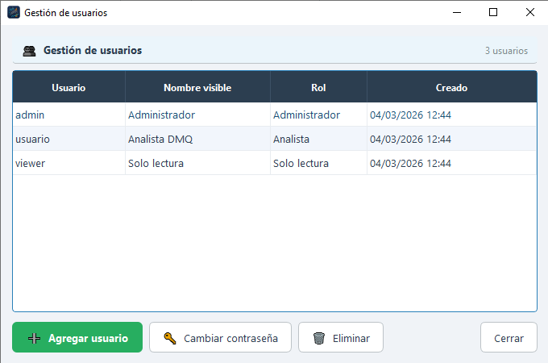
-----------
**Figura 8.** *Ventana de gestión de usuarios.*

### 6.2.2. Procedimiento de la pantalla de gestión de usuarios
Para acceder a la gestión de usuarios:

- Inicie sesión con un usuario que tenga rol Administrador

- En la barra superior de la ventana principal, haga clic en Usuarios

- Espere a que se abra la ventana Gestión de usuarios

Para agregar un nuevo usuario:

- Haga clic en Agregar usuario

- En la ventana emergente, complete los campos Usuario, Nombre visible, Rol, Contraseña y Confirmar

- Haga clic en Crear usuario

- Si los datos son correctos, el nuevo usuario aparecerá en la tabla

Para cambiar la contraseña de un usuario:

- Seleccione un usuario en la tabla

- Haga clic en Cambiar contraseña

- Ingrese la nueva contraseña y su confirmación

- Haga clic en Cambiar

- Si los datos son válidos, el sistema actualizará la contraseña y mostrará un mensaje de confirmación

Para eliminar un usuario:

- Seleccione un usuario en la tabla

- Haga clic en Eliminar

- Confirme la acción en el cuadro de diálogo

- Si confirma, el usuario quedará eliminado y no podrá iniciar sesión

### 6.2.3. Validaciones del sistema de la pantalla de gestión de usuarios
La gestión de usuarios controla los siguientes casos:

- Solo los usuarios con rol **Administrador** pueden acceder a esta opción

- Si el campo **Usuario** está vacío, se muestra el mensaje:  
  **“El nombre de usuario es obligatorio”**

- Si el nombre de usuario contiene espacios, se muestra el mensaje:  
  **“El usuario no puede contener espacios”**

- Si la contraseña tiene menos de 4 caracteres, se muestra el mensaje: **“La contraseña debe tener al menos 4 caracteres”**

- Si la contraseña y su confirmación no coinciden, se muestra el mensaje: **“Las contraseñas no coinciden”**

- Si el usuario ya existe, se muestra el mensaje: **“El usuario ya existe”**

- Al eliminar un usuario, el sistema solicita confirmación antes de completar la acción

- Al cambiar una contraseña correctamente, el sistema muestra un mensaje de confirmación

## 6.3. Historial de datos guardados
Esta sección describe el procedimiento para consultar o eliminar datasets previamente guardados en el historial de la aplicación.

### 6.3.1. Elementos de la pantalla de historial
La ventana de historial contiene los siguientes componentes:

- Encabezado con el título Historial de datos guardados

- Contador de datasets guardados

- Tabla de datasets disponibles

- Botón Cargar seleccionado

- Botón Eliminar

- Botón Actualizar

- Botón Cerrar

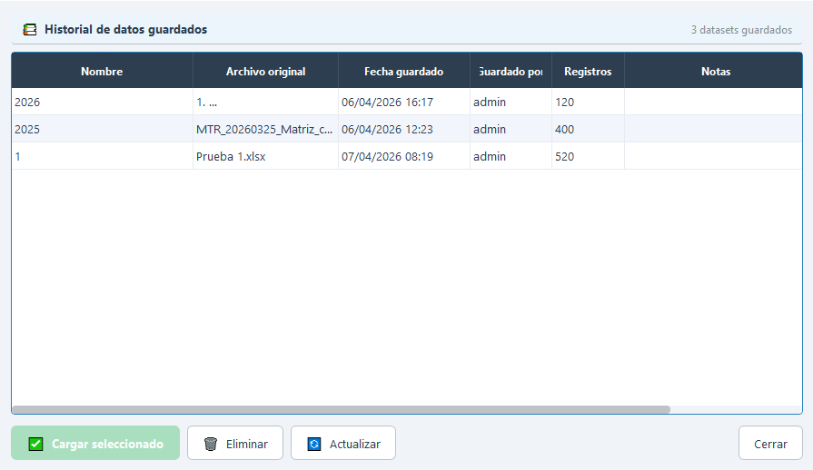
-----------
**Figura 9.** *Ventana de historial de datos guardados.*

### 6.3.2. Procedimiento de la pantalla de historial
Para abrir el historial:

- En la barra superior de la ventana principal, haga clic en Historial

- Espere a que se abra la ventana Historial de datos guardados

Para cargar un dataset guardado:

- Seleccione un registro en la tabla

- Haga clic en Cargar seleccionado

- También puede hacer doble clic sobre el registro deseado

- Espere a que la aplicación recupere los datos y actualice las pestañas: Datos, Gráficos y Mapa

Para eliminar un dataset guardado:

- Seleccione un registro en la tabla

- Haga clic en Eliminar

- Confirme la acción en el cuadro de diálogo correspondiente

- El dataset será removido del historial

Para refrescar la lista:

- Haga clic en Actualizar

- La tabla volverá a consultar los datasets almacenados en el historial

### 6.3.3. Validaciones del sistema de la pantalla de historial
La ventana de historial controla los siguientes casos:

- Si no existen datasets guardados, la tabla muestra el mensaje:

**“No hay datos guardados. Cargue un Excel y de clic en 'Guardar'”**

- Los botones **“Cargar seleccionado”** y **“Eliminar”** permanecen deshabilitados hasta que el usuario seleccione una fila válida

- Si ocurre un error durante la recuperación del dataset, el sistema muestra un mensaje indicando que no se pudo cargar desde el historial

- La carga desde historial recupera directamente el dataset ya procesado, por lo que no se repite el mapeo de columnas

## 6.4. Guardar datos
Esta sección describe el procedimiento para almacenar el dataset actual en el historial, permitiendo recuperarlo posteriormente desde el historial.

### 6.4.1. Elementos de la pantalla de guardado
La ventana de guardado contiene los siguientes componentes:

- Encabezado con el título Guardar dataset

- Indicador del número de datos que serán guardados

- Campo Nombre

- Campo Notas

- Botón Guardar

- Botón Cancelar

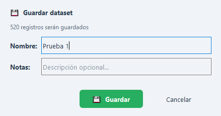
-----------
**Figura 10.** *Ventana de guardado de datos.*

### 6.4.2. Procedimiento de la pantalla de guardado
- Cargue previamente un archivo Excel o recupere un dataset desde el historial

- En la barra superior de la ventana principal, haga clic en Guardar

- Espere a que se abra la ventana Guardar dataset

- En el campo Nombre, escriba un nombre descriptivo para el dataset

- En el campo Notas, escriba una descripción opcional

- Haga clic en Guardar

- Espere a que el sistema almacene la información en el historial

### 6.4.3. Validaciones del sistema de la pantalla de guardado
La ventana de guardado controla los siguientes casos:

- El botón Guardar solo está disponible cuando existe un dataset cargado en la aplicación

- Si el campo Nombre está vacío, el sistema no permite continuar y muestra en el campo la advertencia**: “El nombre es obligatorio”**

- Si ocurre un error al guardar, el sistema muestra un mensaje indicando que no se pudieron guardar los datos

- Si el proceso finaliza correctamente, el sistema muestra un mensaje de confirmación en la barra de estado indicando el nombre y el identificador del dataset guardado

### 6.4.4. Almacenamiento de datasets e historial
Los datasets guardados en el historial se almacenan localmente de forma automática en dos niveles: primero, sus metadatos se registran en la base de datos SQLite, incluyendo el nombre del dataset, archivo fuente, fecha de guardado, usuario responsable, número de filas, mapeo de columnas y notas asociadas; segundo, el contenido completo del dataset procesado se guarda como un archivo serializado en formato .pkl, lo que permite recuperarlo posteriormente sin repetir la carga, validación y procesamiento del archivo Excel original.

Estos archivos se crean automáticamente y se almacenan en la ruta `%LOCALAPPDATA%\INSPI\DMQ_Ovitrampas\datasets\*.pkl`.

## 6.5. Cargar archivo Excel
Esta sección describe el procedimiento para cargar un archivo Excel en la aplicación, validar sus columnas, corregir el mapeo cuando sea necesario y procesar los datos antes de mostrarlos en las pantallas principales.

### 6.5.1. Datos de entrada del archivo Excel
Esta sección detalla las columnas que la aplicación reconoce en el archivo Excel de entrada, su tipo de dato esperado, ejemplos y el uso que el sistema da a cada campo.

| **Campo / Columna**                        | **Tipo de dato**        | **Ejemplo** | **Qué espera el sistema / uso**                                                                                                                                 |
|--------------------------------------------|-------------------------|-------------|-----------------------------------------------------------------------------------------------------------------------------------------------------------------|
| **Código de ovitrampa**                    | Texto                   | P-001       | Identificador único de la ovitrampa. Se usa para reconocer cada registro y mostrarlo en tablas, mapa y análisis.                                                |
| **Semana epidemiológica**                  | Número entero           | 12          | Se usa para ordenar, filtrar y analizar los datos por semana. Debe ser un valor numérico válido.                                                                |
| **Fecha de instalación**                   | Fecha                   | 15/01/2026  | Registra cuándo se instaló la ovitrampa. Se usa como referencia temporal del monitoreo.                                                                         |
| **Fecha de inspección**                    | Fecha                   | 22/01/2026  | Indica cuándo se revisó o recolectó la ovitrampa. Aporta contexto temporal al análisis.                                                                         |
| **Ovitrampa instalada (SI = 1 / NO = 0)**  | Número entero / binario | 1           | El sistema espera 1 para sí y 0 para no. Se usa para validar si la trampa fue instalada.                                                                        |
| **Ovitrampa recuperada (SI = 1 / NO = 0)** | Número entero / binario | 1           | El sistema espera 1 para sí y 0 para no. Se usa para validar si la trampa fue recuperada o inspeccionada.                                                       |
| **Total de huevos *Ae. aegypti***          | Número entero           | 27          | Se utiliza para calcular la densidad e intensidad en el mapa, así como para calcular indicadores como el OPI y el EDI, los cuales se presentan en los gráficos. |
| **Coordenada X**                           | Número decimal          | -78.771029  | Se interpreta como longitud. Se usa para ubicar espacialmente la ovitrampa en el mapa.                                                                          |
| **Coordenada Y**                           | Número decimal          | 0.145107    | Se interpreta como latitud. Se usa para ubicar espacialmente la ovitrampa en el mapa.                                                                           |

### 6.5.2. Elementos de la pantalla de carga de Excel
La pantalla de carga de Excel involucra los siguientes componentes:

- Ventana de selección de archivo

- Ventana Seleccionar hoja del archivo Excel

- Ventana Mapeo de columnas

- Ventana de confirmación para filas de encabezado duplicadas, cuando aplica

- Ventana Problemas detectados en los datos, cuando se detectan filas vacías o con campos clave incompletos

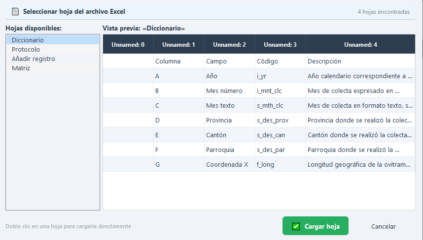
-----------
**Figura 11.** *Ventana de selector de hoja a cargar.*

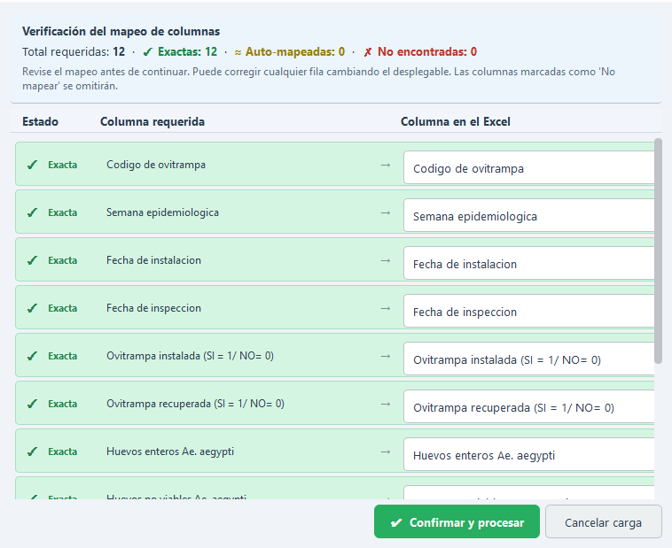
-----------
**Figura 12.** *Ventana de verificación de mapeo de columnas.*

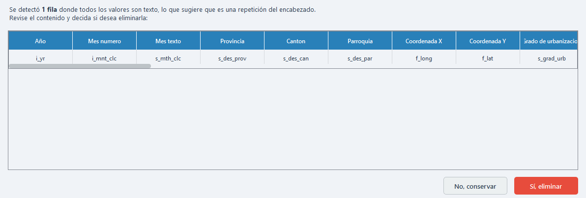
-----------
**Figura 13.** *Ventana de confirmación para filas de encabezado duplicadas.*

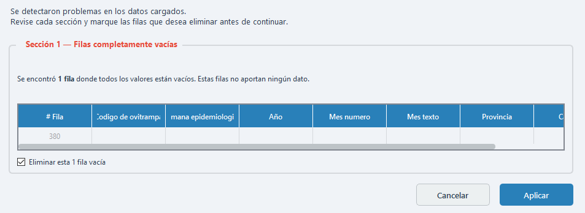
-----------
**Figura 14.** *Ventana Problemas detectados en los datos.*

### 6.5.3. Procedimiento de la pantalla de carga de Excel
- En la barra superior de la ventana principal, haga clic en Cargar Excel

- En la ventana de selección de archivos, busque y seleccione el archivo Excel que desea procesar.

- Si el archivo contiene varias hojas, seleccione una hoja en la ventana Seleccionar hoja del archivo Excel y haga clic en Cargar hoja

- Espere a que la aplicación lea el archivo

- Revise la ventana Mapeo de columnas

- Verifique que cada columna requerida esté asociada con la columna correcta del archivo Excel

- Si es necesario, ajuste manualmente el mapeo utilizando los desplegables

- Continúe con el procesamiento del archivo

- Si el sistema detecta filas que parecen encabezados repetidos, decida si desea eliminarlas

- Si el sistema detecta filas vacías o filas con campos clave incompletos, revise la ventana Problemas detectados en los datos y marque las filas que desea eliminar

- Haga clic en Aplicar para continuar

- Espere a que la aplicación limpie, normalice y cargue los datos

- Una vez finalizado el proceso, la información se mostrará en las pestañas: Datos, Gráficos y Mapa.

### 6.5.4. Validaciones del sistema de la pantalla de carga de Excel
La pantalla de carga de Excel controla los siguientes casos:

- Solo se aceptan archivos de tipo Excel compatibles, como \*.xlsx, \*.xls y \*.xlsm

- Si el archivo no puede leerse, el sistema muestra un mensaje de error indicando que no se pudo cargar el archivo

- Si el archivo contiene varias hojas, el sistema obliga a seleccionar una antes de continuar

- La ventana de mapeo de columnas se muestra siempre, incluso si el auto-mapeo fue exitoso, para que el usuario pueda confirmar la correspondencia de columnas

- Las columnas no encontradas pueden corregirse manualmente o dejarse como No mapear / Omitir

- Si se detectan filas duplicadas de encabezado, el sistema solicita confirmación antes de eliminarlas

- Si se detectan filas vacías o filas sin Código de Ovitrampa o Semana Epidemiológica, el sistema permite revisarlas y decidir si deben eliminarse

- Si ocurre un error durante la limpieza del dataset, el sistema muestra un mensaje indicando que hubo un problema al procesar los datos

- Si la carga finaliza correctamente, la barra de estado muestra un mensaje de confirmación con el número de datos cargados.

## 6.6. Pestaña Datos
Esta sección describe el procedimiento para consultar la información tabular cargada en la aplicación y aplicar filtros locales sobre la vista de datos.

### 6.6.1. Elementos de la pestaña Datos
La pestaña **Datos** contiene los siguientes componentes:

- Barra de filtros

- Filtro Semana Epidemiológica

- Filtro Ovitrampa

- Casillas Solo positivas

- Tabla principal de datos

- Página de mensaje No hay datos que mostrar, cuando no existen resultados

- Barra inferior de estado de la pestaña

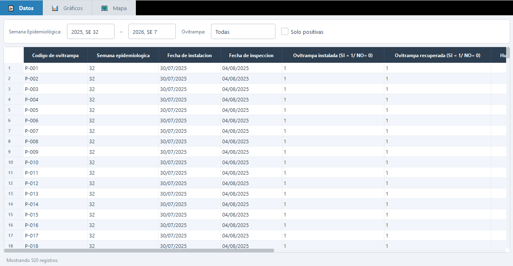
-----------
**Figura 15.** *Pestaña Datos.*

### 6.6.2. Procedimiento de la pestaña Datos
- Cargue un archivo Excel o recupere un dataset desde el historial

- Revise la tabla central con los datos cargados

- Para filtrar por semana, seleccione el rango deseado en el filtro Semana Epidemiológica

- Para filtrar solo la tabla por una ovitrampa específica, seleccione un valor en el filtro Ovitrampa

- Para visualizar únicamente los datos que son positivos en la tabla, marque la casilla **“Solo positivas”**

### 6.6.3. Validaciones del sistema de la pestaña Datos
La pestaña **Datos** controla los siguientes casos:

- El filtro Semana Epidemiológica: se comparte con las pestañas Gráficos y Mapa

- Los filtros Ovitrampa y Solo positivas se aplican únicamente sobre la tabla de la pestaña **Datos**

- Si no existen datos que cumplan con los filtros actuales, se muestra el mensaje: **“No hay datos que mostrar. Los filtros aplicados no arrojaron resultados. Ajuste los criterios de búsqueda e intente nuevamente”**

- Si no hay semanas epidemiológicas válidas disponibles, los controles de semana permanecen deshabilitados

- Durante la aplicación de filtros, la pestaña puede mostrar una pantalla de carga temporal

## 6.7. Pestaña Gráficos
Esta sección describe el procedimiento para visualizar gráficos de análisis e indicadores entomológicos a partir de los datos cargados en la aplicación.

### 6.7.1. Elementos de la pestaña Gráficos
La pestaña **Gráficos** contiene los siguientes componentes:

- Filtro Semana Epidemiológica

- Botones de selección del gráfico

- Botón Exportar

- Área central del visor del gráfico

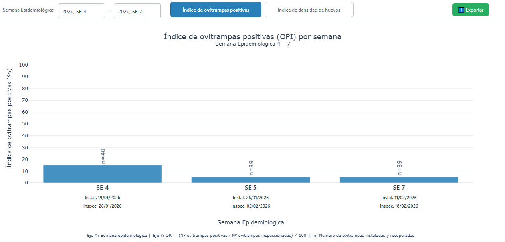
-----------
**Figura 16.** *Pestaña Gráficos.*

### 6.7.2. Procedimiento de la pestaña Gráficos
- Cargue un archivo Excel o recupere un dataset desde el historial

- Seleccione el rango deseado en el filtro Semana Epidemiológica

- Haga clic en uno de los botones de selección para elegir el gráfico que desea visualizar

- Espere a que la aplicación genere el gráfico correspondiente

- Explore el gráfico visualmente y, si lo desea, coloque el cursor sobre las barras para ver información adicional

- Si desea exportar el gráfico actualmente visible, haga clic en Exportar, seleccione la ubicación del archivo y confirme el formato

### 6.7.3. Validaciones del sistema de la pestaña Gráficos
La pestaña **Gráficos** controla los siguientes casos:

- El filtro Semana Epidemiológica: se comparte con las pestañas: Datos y Mapa

- Si no existen datos disponibles, se muestra una pantalla indicando que primero debe cargarse un archivo Excel o que no hay resultados para los filtros actuales

- El botón Exportar solo se habilita cuando existe un gráfico con datos disponibles

- Durante la generación y exportación del gráfico, la pestaña muestra una pantalla de carga temporal

- La exportación actual guarda únicamente el gráfico visible en ese momento

## 6.8. Pestaña Mapa
Esta sección describe el procedimiento para visualizar el mapa interactivo de ovitrampas y exportar una salida cartográfica con layout.

### 6.8.1. Elementos de la pestaña Mapa
La pestaña **Mapa** contiene los siguientes componentes:

- Barra superior del mapa

- Filtro Semana Epidemiológica

- Botón Exportar

- Área central del mapa interactivo

- Control de capas del mapa

- Leyenda del mapa

- Panel de coordenadas del cursor

- Pantalla de carga durante la generación y exportación del mapa

Las capas disponibles en el mapa son:

- Mapa base

- Mapa satelital

- Densidad de huevos por ovitrampa

- Ovitrampas positivas

- Ovitrampas negativas

- Área de estudio: Pacto

- Cuadrícula densidad de huevos (100 x 100m)

- Cuadrícula (100 x 100m)

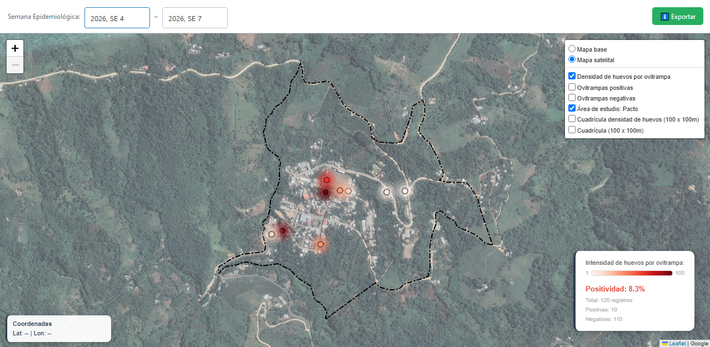
-----------
**Figura 17.** *Pestaña Mapa.*

### 6.8.2. Procedimiento de la pestaña Mapa
- Cargue un archivo Excel o recupere un dataset desde el historial

- Seleccione el rango deseado en el filtro Semana Epidemiológica

- Espere a que la aplicación genere el mapa

- Active o desactive las capas del mapa según la visualización deseada

- Explore el mapa con el mouse para desplazarse, acerque o aleje la vista con la rueda de desplazamiento, con los botones en pantalla o con las teclas + y –

- Coloque el cursor sobre una ovitrampa o sobre una celda de la cuadrícula para visualizar información contextual

- Si desea exportar el mapa, haga clic en Exportar

- Seleccione la ubicación y el nombre del archivo de salida

- Espere a que la aplicación genere la composición cartográfica final

### 6.8.3. Validaciones del sistema de la pestaña Mapa
La pestaña **Mapa** controla los siguientes casos:

- El filtro Semana Epidemiológica: se comparte con las pestañas: Datos y Gráficos

- Si no existen datos con coordenadas válidas, el mapa muestra un estado vacío o una vista sin puntos

- Solo se visualizan datos con coordenadas geográficas válidas

- El mapa se renderiza con una pantalla de carga durante la generación inicial

- La primera vez que se abre la pestaña, el sistema puede realizar una doble carga automática para estabilizar el renderizado inicial

- Durante la exportación, el sistema muestra una pantalla de carga con mensajes de progreso

- La exportación del mapa utiliza un layout cartográfico predefinido y un recorte geográfico fijo del área de estudio

# 7. Casos especiales durante la carga, análisis y visualización de datos
El sistema cuenta con controles para manejar datos incompletos o insuficientes, evitando errores durante el uso de la aplicación y mostrando mensajes informativos cuando no es posible calcular un indicador o generar una visualización.

## 7.1. Ausencia de ovitrampas positivas
Cuando no existen ovitrampas positivas en el conjunto de datos, el sistema continúa funcionando normalmente, muestra 0 ovitrampas positivas y una positividad de 0,0 %. En gráficos, el OPI o EDI pueden mostrarse vacíos con mensajes como: “No hay ovitrampas positivas en el período seleccionado” o “No se registraron huevos en el período seleccionado”.

## 7.2. Denominador igual a cero
Si no existen datos suficientes para calcular un porcentaje o promedio, el sistema evita la división por cero y no interrumpe su funcionamiento. En estos casos, el indicador se muestra como 0,0 %, vacío o no calculable, según corresponda.

## 7.3. Ausencia de semanas epidemiológicas válidas
Si el archivo no contiene semanas epidemiológicas válidas, el sistema no las corrige ni las genera automáticamente. Los filtros de semana se deshabilitan y las pestañas dependientes de este campo muestran mensajes indicando que no existen datos válidos.

## 7.4. Ausencia de coordenadas válidas
Si no existen coordenadas válidas de latitud y longitud, el mapa no puede mostrar puntos geográficos y presenta un mensaje informativo. Los datos pueden seguir visualizándose en la tabla, pero no aparecerán en el mapa.

## 7.5. Duplicados reales en los datos
El sistema puede detectar filas que parecen encabezados repetidos y solicitar su eliminación, pero no elimina automáticamente duplicados reales de ovitrampas, semanas, fechas u otros campos. Si existen duplicados reales, estos se conservan y pueden afectar los indicadores, gráficos y mapa, por lo que deben revisarse previamente en el archivo Excel.
